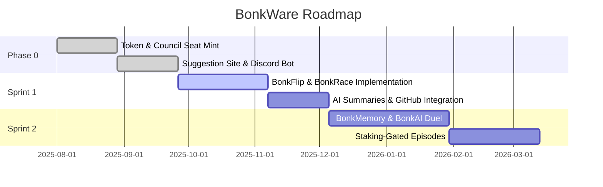

# BonkWare Documentation

## 1. Introduction

BonkWare is a community-driven AI evolution platform that combines governance, gaming, and autonomous development. Our platform enables community members to propose, vote on, and implement new features through a decentralized governance system powered by Solana blockchain technology.

### Key Goals and Audience
- **Community-First Development**: Enable token holders to directly influence platform evolution
- **Transparent Governance**: On-chain voting through Council of Architects NFT holders
- **Gamified Experience**: Engaging mini-games and narrative elements
- **Autonomous Execution**: AI-driven implementation of approved proposals

**Target Audience**: Crypto enthusiasts, gamers, developers, and community governance advocates

---

## 2. Platform Architecture

### 2.1 Suggestion & Governance Flow

The BonkWare governance system follows a structured flow:

```
Draft → Review → Council Proposal → Implementation Queue
```

**Process Overview:**
- **Draft Phase**: Community members submit suggestions and ideas
- **Review Phase**: Initial community feedback and refinement
- **Council Proposal**: Formal proposal submitted to Council of Architects
- **Implementation Queue**: Approved proposals enter development pipeline

#### Council of Architects (100 Seat NFTs)
- **100 NFT Seats**: Limited governance positions with voting rights
- **Voting Power**: Each NFT represents one vote in governance decisions
- **Requirements**: Stake-to-Submit mechanics ensure quality proposals
- **Platform**: On-chain voting via Solana Realms

### 2.2 Autonomous Execution Engine (Spec Only)

> **Note:** We are *not* building the AI here—just documenting how it *would* tie together once implemented.

**Component Architecture:**
- **Suggestion Ingestor**: Processes and categorizes community proposals
- **Spec Generator**: Uses Claude Sonnet to create technical specifications
- **Eliza OS Sandbox**: Safe testing environment with CI pipeline
- **Multisig Deployment Agent**: Secure deployment mechanism
- **Monitoring & Rollback**: Continuous monitoring with automatic rollback capabilities

---

## 3. Feature Modules

### 3.1 BonkWare Game Suite

#### Core Games
- **BonkFlip**: Classic coin flip with BonkWare theming
- **BonkRace**: Fast-paced racing mini-game
- **BonkMemory**: Memory matching game with NFT rewards
- **BonkAI Duel**: Player vs AI strategy battles

#### Engagement Features
- **Seasonal Modes**: Limited-time game variants
- **Leaderboards**: Community rankings and achievements
- **Tournaments**: Regular competitive events with prizes

### 3.2 Narrative-Driven Elements

#### Content Features
- **Evolution Episodes**: Weekly mini-comics showcasing platform development
- **Memory Vault "Replay" NFTs**: Collectible moments from platform history
- **Interactive Council Chatbot**: AI assistant for governance questions

---

## 4. Incentives & Reputation

### Reward Systems
- **Suggestion Bounties**: Tokens awarded for implemented proposals
- **Reputation Badges**: Visual recognition for community contributions
- **Stake-to-Submit Mechanics**: Quality assurance through economic incentives

### Participation Benefits
- **Voting Power**: Increased influence through active participation
- **Exclusive Access**: Early access to new features and content
- **NFT Rewards**: Special collectibles for top contributors

---

## 5. Developer Pipeline & Transparency

### Integration Features
- **GitHub Integration**: Automatic issue creation and PR management
- **Public Kanban Board**: Real-time development progress tracking
- **Automated Release Alerts**: Community notifications for updates

### Development Process
- **Open Source**: All code publicly available and auditable
- **Continuous Integration**: Automated testing and deployment
- **Community Code Review**: Public review process for major changes

---

## 6. Cross-Channel Engagement

### Social Media Integration
- **Discord/Telegram Bots**: Automated community management and notifications
- **Twitter/X Integration**: "Game of the Day" tweets and announcements
- **Content Schedule**: Regular Twitch/YouTube livestream programming

### Community Touchpoints
- **Multi-Platform Presence**: Consistent experience across channels
- **Real-Time Updates**: Live notifications of governance and development
- **Interactive Elements**: Community polls and feedback mechanisms

---

## 7. Security & Trust

| Layer               | Tool/Pattern                              | Purpose                        |
|---------------------|-------------------------------------------|--------------------------------|
| Multisig            | 5-of-7 Squads                             | Prevent rogue deployments      |
| Timelock            | 48-hour TimelockController                | Delay admin changes            |
| Audit & Bounty      | CertiK + Immunefi                         | Continuous security oversight  |
| Open Source         | GitHub Repo & Verified Program IDs        | Transparency and reviewability |

### Security Measures
- **Multi-Signature Wallets**: Require multiple approvals for critical operations
- **Time-Delayed Execution**: 48-hour delay for administrative changes
- **Continuous Auditing**: Regular security assessments and bug bounties
- **Transparency**: All code and transactions publicly verifiable

---

## 8. Roadmap & Milestones



### Development Phases
- **Phase 0 (Complete)**: Foundation and governance structure
- **Sprint 1 (Current)**: Core gaming features and AI integration
- **Sprint 2 (Planned)**: Advanced games and premium content

---

## 9. Appendix

### Glossary of Terms
- **SPL**: Solana Program Library - standard for tokens on Solana
- **NFT**: Non-Fungible Token - unique digital assets
- **Multisig**: Multi-signature wallet requiring multiple approvals
- **DAO**: Decentralized Autonomous Organization
- **Realms**: Solana's governance platform
- **CI/CD**: Continuous Integration/Continuous Deployment

### Important Links
- [GitHub Repository](#) - *To be updated*
- [Discord Community](#) - *To be updated*
- [Governance Portal](#) - *To be updated*
- [Game Suite](#) - *To be updated*

### Technical References
- [Solana Documentation](https://docs.solana.com)
- [Realms Governance](https://realms.today)
- [SPL Token Program](https://spl.solana.com/token)

---

> **Disclaimer:** This documentation describes the planned functionality of BonkWare. Features and implementation details may change during development. This is documentation only—no AI or backend code implementation is included in this output.
